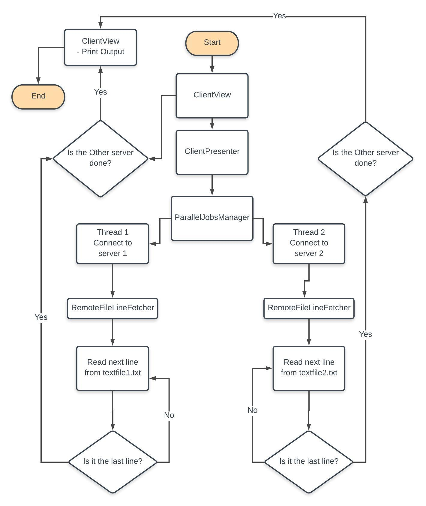
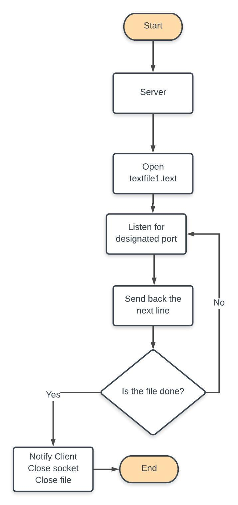

# Top5WordsFetcher

This is a small project written in Java implementing a client connecting in parallel with two server via sockets to get the most repeated words in two ISO 8859-1 encoded files that the servers read and send back to the client. 

## App archicture
## Client

## Server

### Prerequisites

- Java SE Development Kit 8u191

### Installing

1- Run from the source code:
 - Clone or download the repository.
 - Open the project in Eclipse or your favorite IDE.
 - Right-click one src > server > Server1.java, choose "Run As" > "Java Application". The console will print "Server 1 waiting for client request".
 - Repeat for src > server > Server2.java to get output > "Server 2 waiting for client request".
 - Repeat for src > client > MainClass.java.
 - What the magic unfold.
 
 2- Run from jar files:
  - Run server1.jar, server2.jar then client.jar.
